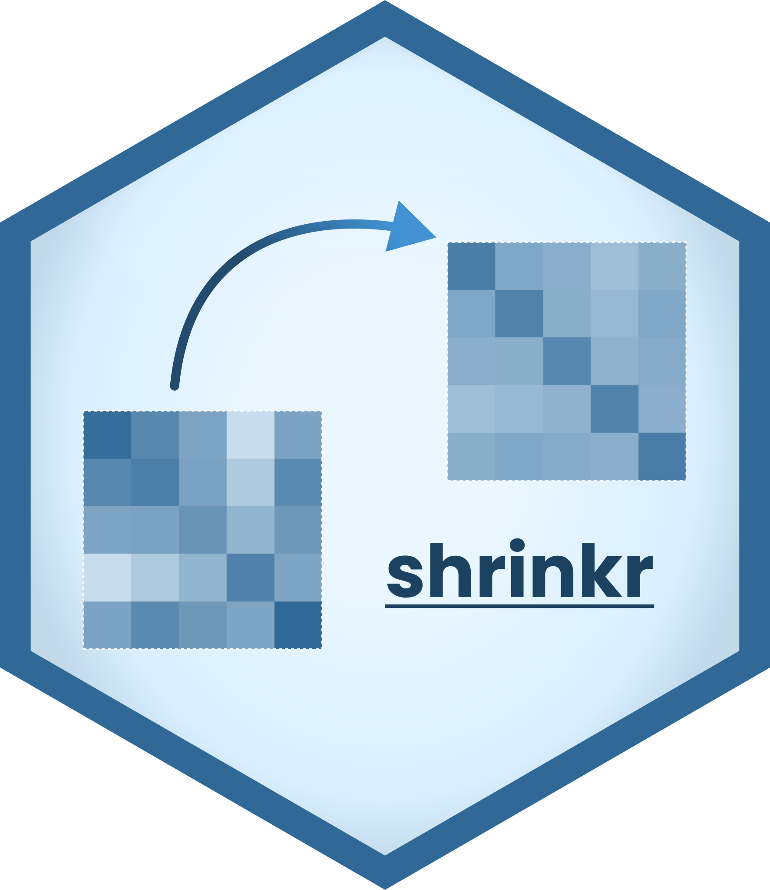

# Shrinkr - Covariance matrix shrinkage and LDA
<a href="https://jgrzywaczewski.com/shrinkr">
    
</a>

[](https://github.com/ZetrextJG/shrinkr/actions/workflows/tests.yml)

Shrinkr is a Python package for covariance matrix shrinkage and Linear Discriminant Analysis.
Methods are implemented in C for performance and exposed through a clean Python interface.

## Installation

Currently the package is only on GitHub. Install most recent release with:
```sh
pip install git+https://github.com/ZetrextJG/shrinkr@latest
```

> PyPI release coming soon.


## Usage example

Also located in the [ready to run script](https://github.com/ZetrextJG/shrinkr/blob/main/.devel/usage.py).

```python
from shrinkr import CovarianceEstimator
from shrinkr import LinearDiscriminantAnalysis as LDA
from shrinkr.functional import accuracy
from shrinkr.monte_carlo import get_guassian_lda_samples

# Generate Gaussian data for covariance estimation and LDA
X, y = get_guassian_lda_samples(p=20, n_per_class=200, seed=1)

# Shrunk covariance estimation:
# Methods like LW Linear, OAS, LW Analytical.
total_covariance = CovarianceEstimator(method="lw_linear").fit_predict(X)
assert total_covariance.shape == (20, 20)

# Linear Discriminant Analysis with Shrunk covariance estimation:
# Supports all methods from CovarianceEstimator
# but also LDA specialized shrinkages like DEAL.
classifier = LDA(method="deal")
classifier.fit(X, y)
y_pred = classifier.predict(X)
print(accuracy(y, y_pred)) # 0.935, quite a simple task
```

## Documentation

Documentation site is hosted on [GitHub Pages](https://jgrzywaczewski.com/shrinkr/).
Build with [MkDocs](https://www.mkdocs.org/) for Python and [Doxygen](https://www.doxygen.nl/) for C
API Reference.

## Structure

Main classes `CovarianceEstimator` and `LinearDiscriminantAnalysis` are importable
directly from the package root `shrinkr.*`.
All shrinkage methods are implemented functionally in the `shrinkr.functional` module,
with reference Python/NumPy implementations in `shrinkr.reference`.
Additionally Monte Carlo implementations used for tests (and more) 
are located in the `shrinkr.monte_carlo`.

## Development

The project is set up with [uv](https://docs.astral.sh/uv/):
```sh
uv sync --dev
```

The pure C code can be found in `./src` with the Python
bindings in `./shrinkr/bindings.c` which are exposed via the
`shrinkr._native` module with type interface in `./shrinkr/_native.pyi`.

### Testing

All tests are in `./.devel/tests` and are handled with [pytest](https://docs.pytest.org/en/stable/).

To run the unit test suite:
```sh
uv run pytest -m unit
```
Unit tests are designed to run in under a second and execute on every commit.

To run the property-based test suite:
```sh
uv run pytest -m prop
```
Property-based tests cover a wide range of inputs and are expected to run before releases.

### Styling

Styling is handled entirely with [ruff](https://docs.astral.sh/ruff/) and enforced on every commit by [pre-commit](https://pre-commit.com/).
Docstrings must be in the [numpy docstring](https://numpy.org/doc/1.19/docs/howto_document.html)
format. Also enforced by *ruff*.

### Benchmarking

Benchmarking tools can be found in `./.devel/bench`.
Those utilize [pytest-benchmark](https://github.com/ionelmc/pytest-benchmark) for
benchmarking together with Python wrappers and [Google's benchmark](https://github.com/google/benchmark)
for the benchmarking pure C implementation.

## Benchmark results

Benchmarking results run on a Lenovo ThinkSystem SR665 with 2x AMD EPYC 7413 48 Core Processors and sufficient RAM. 
The number of cores is restricted to 16. *Numpy* was installed with *uv*.

## See also

Other amazing projects from which I took motivation:
- [scikit-learn](https://github.com/scikit-learn/scikit-learn): Machine Learning in Python
- [deadwood](https://github.com/gagolews/deadwood): Outlier Detection via Pruning Mutual Reachability Minimum Spanning Trees
- [gips](https://github.com/PrzeChoj/gips): Gaussian model Invariant by Permutation Symmetry

